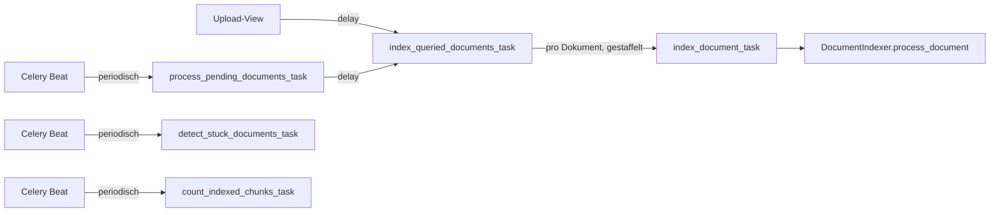
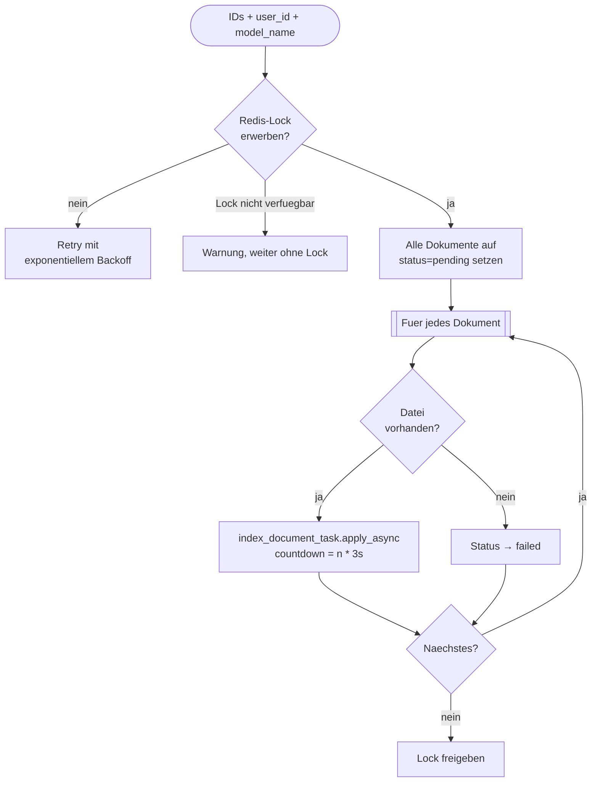
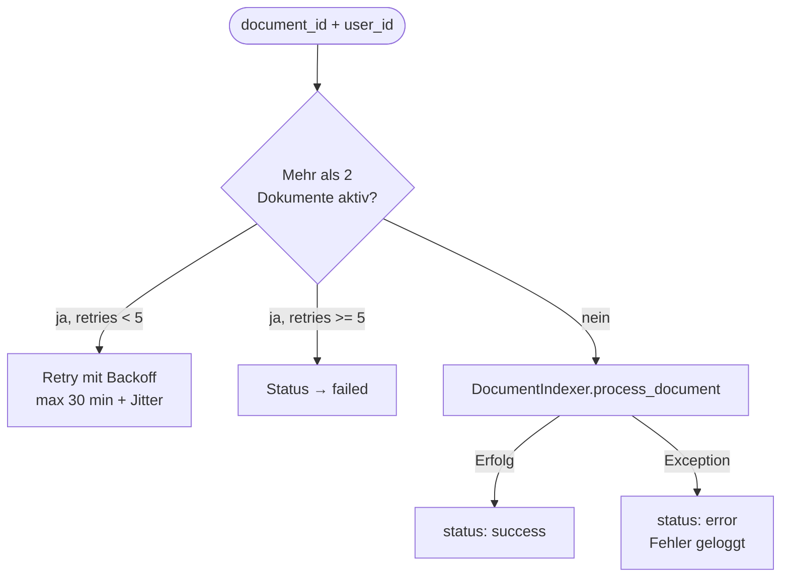
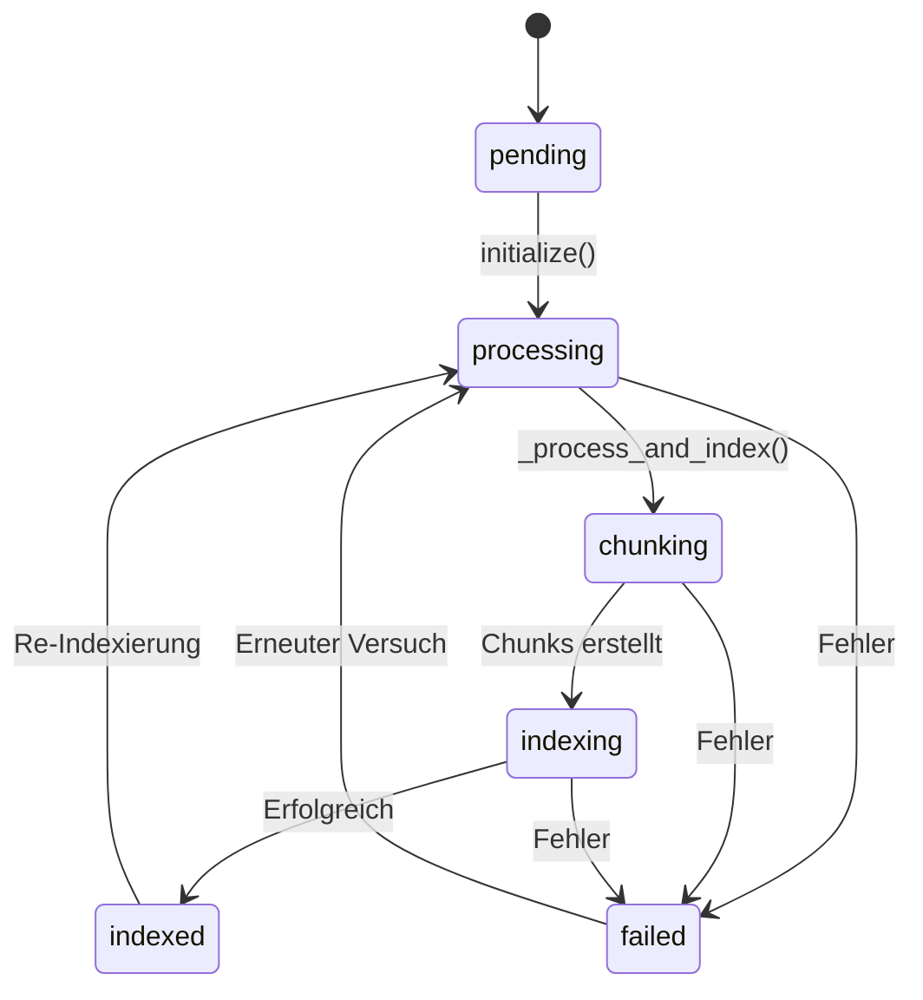
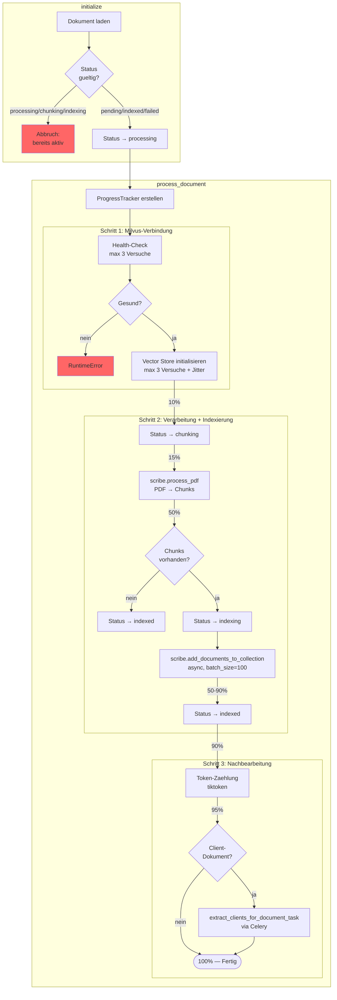
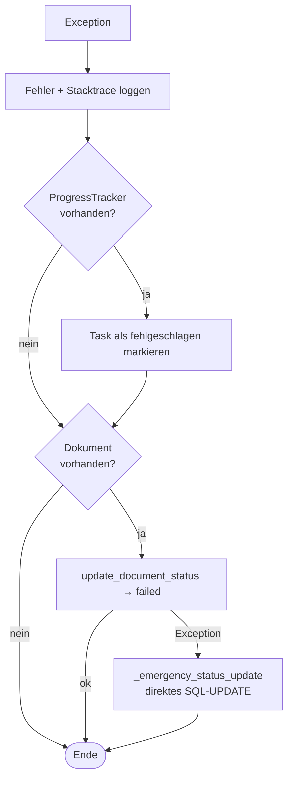

# `index_document.py` — Dokument-Indexierung

Celery-Tasks und Indexer-Klasse fuer die Volltextindexierung von Dokumenten in Milvus (Vektordatenbank).
Wird nach dem Upload ausgeloest und macht Dokumente fuer AI-Suche, InfoMemo und Chat verfuegbar.

## Ueberblick

## Celery-Tasks

### `index_queried_documents_task` — Batch-Einstiegspunkt

Wird direkt vom Upload-View aufgerufen. Verarbeitet eine Liste von Dokument-IDs.

**Staffelung**: Jeder Task wird um `n * 3 Sekunden` verzoegert, um das System nicht zu ueberlasten.

**Redis-Lock**: `indexing:all_documents` mit 1h Timeout und Auto-Renewal alle 30s. Verhindert parallele Batch-Laeufe.

### `index_document_task` — Einzeldokument-Task

Prueft Parallelitaet und delegiert an `DocumentIndexer`.

**Parallelitaetslimit**: Max. 2 Dokumente gleichzeitig in `processing/chunking/indexing` (beide Modelle zusammen).

### `process_pending_documents_task` — Geplanter Batch-Lauf

Periodischer Task (Celery Beat). Sucht alle Dokumente mit `indexing_status=pending` und uebergibt sie an `index_queried_documents_task`.

### `detect_stuck_documents_task` — Haengende Dokumente erkennen

Periodischer Task. Findet Dokumente, die zu lange in einem aktiven Status stecken (via `check_stuck_documents`), und loggt Details.

### `count_indexed_chunks_task` — Chunk-Zaehler aktualisieren

Zaehlt fuer alle Projekte und Dokumente die tatsaechlich in Milvus vorhandenen Chunks und aktualisiert `indexed_chunks` in der DB.

## `DocumentIndexer` — Kernklasse

### Statusuebergaenge

Ungueltige Uebergaenge (z.B. `chunking → processing`) werden in `initialize()` abgefangen.

### Verarbeitungspipeline

### Fortschrittsanzeige

| Prozent | Phase |
|---------|-------|
| 10% | Vector Store initialisiert |
| 15% | PDF-Verarbeitung gestartet |
| 50% | PDF verarbeitet und in Chunks zerlegt |
| 50–90% | Batch-Indexierung (linear innerhalb dieses Bereichs) |
| 90% | Indexierung abgeschlossen |
| 95% | Token-Zaehlung |
| 100% | Fertig |

### Retry- und Backoff-Strategie

| Ebene | Max. Versuche | Backoff | Jitter |
|-------|---------------|---------|--------|
| Milvus Health-Check | 3 | 2s → 4s → 8s (max 30s) | nein |
| Vector Store Init | 3 | 2s → 4s → 8s (max 30s) | ja (±10%) |
| `index_document_task` Parallelitaet | 5 | 60s → 120s → ... (max 30 min) | ja (±25%) |
| `index_queried_documents_task` Lock | 5 | 60s → 120s → 240s → ... | nein |

### Fehlerbehandlung

Drei Eskalationsstufen:
1. **ORM**: `update_document_status(doc, "failed")` — Standardweg
2. **Emergency SQL**: Direktes `UPDATE`-Statement als Fallback wenn ORM fehlschlaegt
3. **Logging**: Fehler wird immer protokolliert, auch wenn Status-Update scheitert

### Collection-Benennung

| Dokumenttyp | Milvus-Collection |
|------------|-------------------|
| `ProtectedProjectDocument` | `project_{project.id}` |
| `ProtectedClientDocument` | `client_{client.id}` |

### Client-Extraktion (nur ProtectedClientDocument)

Nach erfolgreicher Indexierung wird `extract_clients_for_document_task` als Celery-Task gestartet,
sofern `client_extraction_status` in `[None, "", "pending", "failed", "skipped"]` liegt.
Dies extrahiert Mandanteninformationen aus dem Dokumentinhalt.
