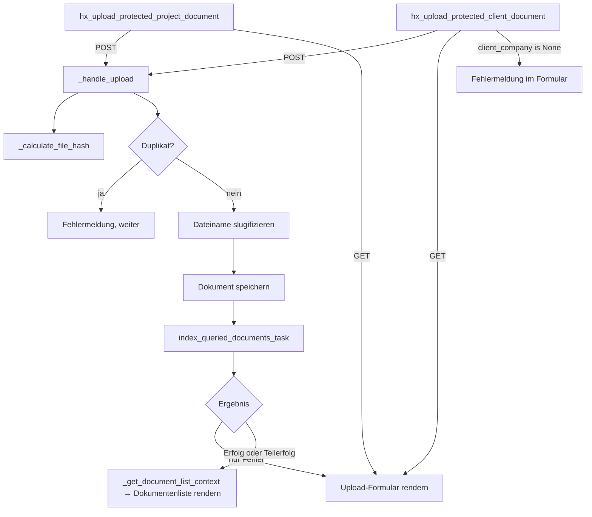
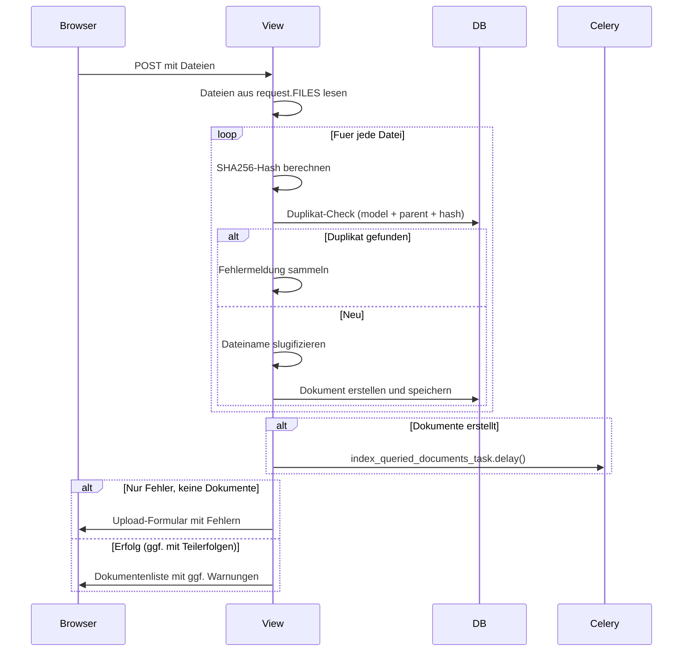

# `upload_protected_document.py` — Dokument-Upload-Endpunkte

Zwei HTMX-POST/GET-Endpunkte fuer den Datei-Upload im Datenraum.
Projekt- und Firmendokumente werden getrennt behandelt, teilen sich aber denselben Upload-Mechanismus.

## URLs

| URL | View | Model |
|-----|-------|-------|
| `hx/<pk>/upload/project/` → `hx-upload-project` | `hx_upload_protected_project_document` | `ProtectedProjectDocument` |
| `hx/<pk>/upload/client/` → `hx-upload-client` | `hx_upload_protected_client_document` | `ProtectedClientDocument` |

## Architektur

Zwei duenne View-Funktionen delegieren an einen gemeinsamen `_handle_upload`-Handler:



## Upload-Ablauf im Detail



## Oeffentliche Views

### `hx_upload_protected_project_document`

- **Guards**: `@otp_required`, `@project_permission_required(htmx_required=True)`
- **GET**: Zeigt Upload-Formular
- **POST**: Erstellt `ProtectedProjectDocument`-Eintraege mit `parent_kwargs={"project": project}`
- Fallback-Dokumenttyp: `ProjectDocumentType.OTHER`

### `hx_upload_protected_client_document`

- **Guards**: wie oben
- **Client-Auto-Zuordnung**: Wenn der User ein Client ist und `project.client_company` leer ist, wird seine Firma automatisch zugewiesen
- **Guard bei fehlendem Client**: Wenn `client_company` danach immer noch `None` ist, wird das Formular mit Fehlermeldung zurueckgegeben (kein DB-Crash)
- **GET**: Zeigt Upload-Formular
- **POST**: Erstellt `ProtectedClientDocument`-Eintraege mit `parent_kwargs={"client": client}`
- Fallback-Dokumenttyp: `ClientDocumentType.OTHER`

## Private Hilfsfunktionen

| Funktion | Zweck |
|----------|-------|
| `_handle_upload(...)` | Gemeinsamer POST-Handler: Hash → Duplikat-Check → Slugify → Speichern → Indexierung → Response |
| `_calculate_file_hash(file)` | SHA256-Hash einer hochgeladenen Datei |
| `_get_document_list_context(project, user)` | Baut den Context-Dict fuer `_show_protected_documents.html` (inkl. `not_partner`) |
| `_get_company_documents(project)` | Firmendokumente gruppiert nach `linked_client` |
| `_is_not_partner(user)` | Spiegelt die `is_not_partner`-Template-Tag-Logik fuer View-Context |

## Templates

| Template | Verwendung |
|----------|------------|
| `_hx_upload_protected_document.html` | Upload-Modal (GET und Fehler-Response) |
| `_show_protected_documents.html` | Dokumentenliste (Erfolg-Response) |

## Parameter von `_handle_upload`

```python
_handle_upload(
    request, project, *,
    model_class,          # ProtectedProjectDocument oder ProtectedClientDocument
    parent_kwargs,        # {"project": ...} oder {"client": ...}
    doc_type,             # vom User gewaehlter Dokumenttyp
    default_type,         # Fallback wenn doc_type leer
    indexing_model_name,  # "ProtectedDocument" oder "ProtectedClientDocument"
    upload_url_name,      # URL-Name fuers Formular-Action
)
```
