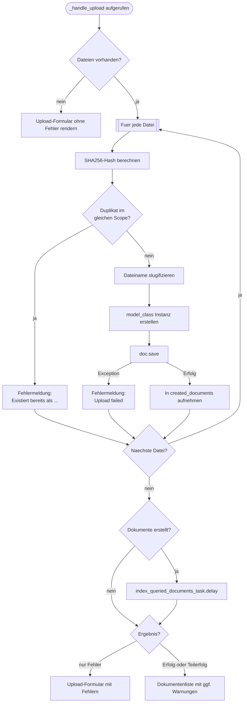
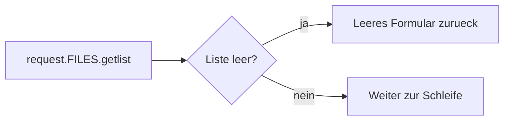
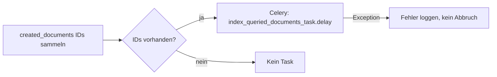
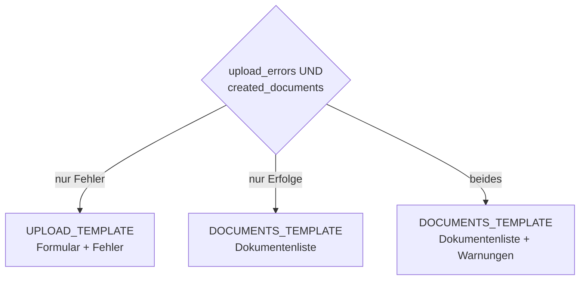

# `_handle_upload` — Gemeinsamer Upload-Handler

Zentrale Funktion, die den POST-Upload fuer beide Dokumenttypen
(`ProtectedProjectDocument` und `ProtectedClientDocument`) abwickelt.
Wird ausschliesslich von den beiden oeffentlichen Views aufgerufen.

## Signatur

```python
_handle_upload(
    request, project, *,
    model_class,          # Django-Model (ProtectedProjectDocument / ProtectedClientDocument)
    parent_kwargs,        # FK-Zuordnung: {"project": ...} oder {"client": ...}
    doc_type,             # Vom User gewaehlter Dokumenttyp (kann leer sein)
    default_type,         # Fallback: ProjectDocumentType.OTHER / ClientDocumentType.OTHER
    indexing_model_name,  # String fuer Celery-Task: "ProtectedDocument" / "ProtectedClientDocument"
    upload_url_name,      # URL-Name fuers hx-post im Formular
)
```

Alle Parameter nach `project` sind keyword-only (`*`), um Verwechslungen zu vermeiden.

## Gesamtablauf



## Phasen im Detail

### 1. Dateien pruefen (Zeile 92–98)



Wenn der User das Formular ohne Dateiauswahl abschickt, wird das Upload-Modal
erneut angezeigt — ohne Fehlermeldung, da kein eigentlicher Fehler vorliegt.

### 2. Datei-Schleife (Zeile 103–138)

Jede Datei durchlaeuft drei Schritte:

**a) Duplikat-Erkennung**
- SHA256-Hash wird ueber `_calculate_file_hash` berechnet (8 KB Chunks, Dateizeiger wird zurueckgesetzt)
- Query: `model_class.objects.filter(**parent_kwargs, file_hash=hash)`
- Scope ist durch `parent_kwargs` begrenzt — dieselbe Datei in verschiedenen Projekten/Firmen ist kein Duplikat

**b) Dateiname slugifizieren**
- `os.path.splitext` trennt Name und Endung
- `slugify_de` (deutsche Sonderzeichen: ae→ae, ss→ss etc.) auf den Basisnamen
- Endung wird in Kleinbuchstaben umgewandelt
- Originaler Basisname wird als `doc.name` gespeichert (Anzeigename)

**c) Dokument erstellen**
- `model_class(...)` mit allen Feldern, `doc.save()` schreibt in DB + Dateisystem
- `user_type` und `user_company` werden am Dokument gespeichert fuer spaetere Filterung
- Bei Exception: Fehlermeldung wird gesammelt, Schleife laeuft weiter

### 3. Indexierung (Zeile 140–146)



- Asynchroner Celery-Task fuer Volltextindexierung (AI-Suche, InfoMemo)
- Fehler beim Task-Versand blockieren den Upload nicht

### 4. Response (Zeile 148–158)



| Szenario | Template | Inhalt |
|----------|----------|--------|
| Alle Uploads fehlgeschlagen | `_hx_upload_protected_document.html` | Formular bleibt offen, Fehler werden angezeigt |
| Alle erfolgreich | `_show_protected_documents.html` | Modal schliesst, Dokumentenliste wird aktualisiert |
| Teilerfolg | `_show_protected_documents.html` | Dokumentenliste + gelbe Warnbox mit uebersprungenen Dateien |

## HTMX-Zusammenspiel

Das Formular verwendet `hx-target="#show-documents" hx-swap="outerHTML"`.
Dadurch ersetzt die Response entweder:
- das Modal durch sich selbst (Fehlerfall, gleiches `#upload-documents` div), oder
- den gesamten `#show-documents`-Container durch die aktualisierte Dokumentenliste (Erfolg)
